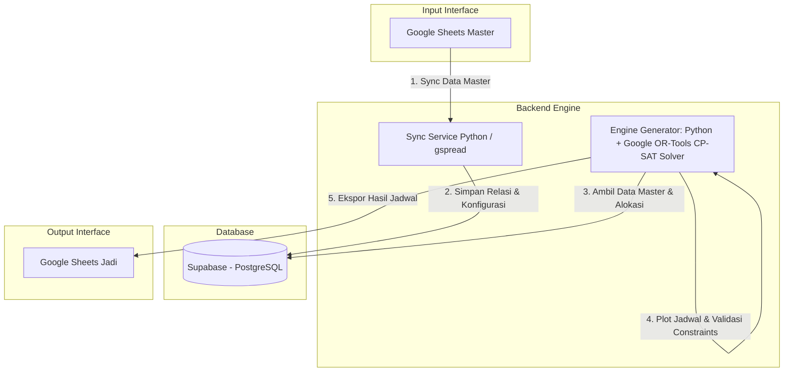
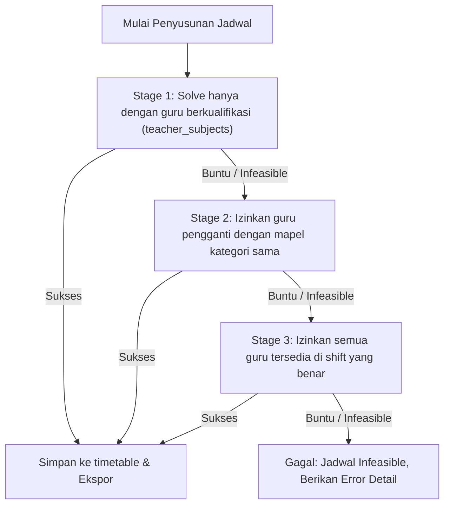

# 📘 SYSTEM BLUEPRINT: AUTOMATIC TIMETABLE GENERATOR (DUAL-SHIFT SMK)

Sistem ini adalah generator jadwal pelajaran sekolah otomatis berbasis Web (**Python Backend & Supabase (PostgreSQL) Database**) yang terintegrasi dengan **Google Sheets API** sebagai **Input Interface** (untuk mengimpor data master) dan **Output Interface** (untuk mengekspor hasil jadwal dalam format siap cetak).

---

## 1. PENDAHULUAN & ARSITEKTUR UTAMA

Sistem dirancang untuk menyusun jadwal pelajaran otomatis di lingkungan SMK dengan sistem **dua shift (Pagi & Siang)**.

### Arsitektur Aliran Data



---

## 2. FORMAT DATA INPUT

Data input di dalam Google Sheets harus mengikuti struktur kolom berikut.

> **Urutan pengisian tab bersifat WAJIB dan sequential.** Sistem akan menolak proses sync dan memberikan error deskriptif jika tab sebelumnya belum terisi, karena setiap tab bergantung pada data tab sebelumnya.

```
Tab 1: master_guru
   ↓ (harus selesai dulu)
Tab 2: master_kelas
   ↓ (harus selesai dulu)
Tab 3: master_mapel
   ↓ (harus selesai dulu)
Tab 4: alokasi_kurikulum  ←── membutuhkan data kelas & mapel
   ↓ (harus selesai dulu)
Tab 5: penugasan_guru     ←── membutuhkan data guru & mapel
   ↓
[Siap → Jalankan Solver]
```

---

### A. Tab `master_guru`
Menyimpan daftar guru, hari ketersediaan, dan shift kerja.
*   **Kolom**:
    1.  `nama_guru` (Teks)
    2.  `kode_guru` (Angka unik, contoh: `101`, `102`)
    3.  `hari_tersedia` (Teks dipisahkan koma, contoh: `SENIN, RABU, JUMAT`) — hari ketersediaan umum
    4.  `shift_pagi` (TRUE/FALSE atau YA/TIDAK)
    5.  `shift_siang` (TRUE/FALSE atau YA/TIDAK)
    6.  `hari_tersedia_pagi` (Teks dipisahkan koma — hari spesifik shift pagi)
    7.  `hari_tersedia_siang` (Teks dipisahkan koma — hari spesifik shift siang)

### B. Tab `master_kelas`
Menyimpan daftar rombongan belajar (rombel), shift belajar, tingkat, dan jurusan.
*   **Dependency**: Tab A (`master_guru`) harus sudah terisi.
*   **Kolom**:
    1.  `nama_kelas` (Teks unik, contoh: `X TKJ 1`, `XI TKR 2`)
    2.  `shift_operasional` (Pilihan: `PAGI` atau `SIANG`)
    3.  `tingkat` (Teks, contoh: `X`, `XI`, `XII`)
    4.  `jurusan` (Teks, contoh: `TKJ`, `AKL`, `TKR`)

### C. Tab `master_mapel`
Menyimpan daftar mata pelajaran beserta jenis kategori, tingkat, dan jurusan.
*   **Dependency**: Tab B (`master_kelas`) harus sudah terisi.
*   **Kolom**:
    1.  `nama_mapel` (Teks)
    2.  `kategori_mapel` (Pilihan: `UMUM`, `OLAHRAGA`, atau `PRODUKTIF`)
    3.  `tingkat` (Teks — tingkat kelas yang menggunakan mapel ini, kosongkan jika berlaku semua tingkat)
    4.  `jurusan` (Teks — jurusan yang menggunakan mapel ini, kosongkan jika berlaku semua jurusan)

### D. Tab `alokasi_kurikulum`
Menghubungkan kelas dan mata pelajaran beserta durasi JP per minggu. **Tidak menyertakan nama guru** — penugasan guru diatur di Tab E.
*   **Dependency**: Tab C (`master_mapel`) harus sudah terisi. Nama kelas dan nama mapel harus **persis sama** dengan data di Tab B dan C.
*   **Kolom**:
    1.  `nama_kelas` (Teks — merujuk ke nama kelas di `master_kelas`)
    2.  `nama_mapel` (Teks — merujuk ke nama mapel di `master_mapel`)
    3.  `durasi_jp` (Angka — total JP per minggu untuk mapel tersebut di kelas tersebut)
*   **Aturan**: Total `durasi_jp` per kelas tidak boleh melebihi **40 JP**. Sync akan gagal (error) jika ada kelas yang total JP-nya > 40.

### E. Tab `penugasan_guru`
Menentukan guru mana saja yang **boleh / mampu** mengajar suatu mata pelajaran. Data ini membentuk *pool* guru yang akan digunakan solver saat memilih siapa yang mengisi slot jadwal.
*   **Dependency**: Tab D (`alokasi_kurikulum`) harus sudah terisi. Nama guru dan nama mapel harus **persis sama** dengan Tab A dan C.
*   **Kolom**:
    1.  `nama_guru` (Teks — merujuk ke nama guru di `master_guru`)
    2.  `nama_mapel` (Teks — merujuk ke nama mapel di `master_mapel`)
*   **Contoh**:

    | nama_guru | nama_mapel |
    | :--- | :--- |
    | Budi Santoso, S.Pd | Matematika |
    | Siti Aminah, S.Pd | Matematika |
    | Siti Aminah, S.Pd | Penjasorkes |
    | Eko Prasetyo, S.Kom | Pemrograman Web |

---

### ⚠️ Validasi Coverage Guru (Warning System)

Setelah Tab E diisi dan proses sync dijalankan, sistem secara otomatis menghitung **kecukupan sebaran guru** per kombinasi `shift × hari` dan memberikan peringatan jika distribusi belum optimal.

**Logika Kalkulasi Coverage:**

```
Untuk setiap kombinasi (shift, hari):

  guru_tersedia(shift, hari) =
      COUNT guru WHERE:
        (shift = PAGI  AND shift_pagi = TRUE  AND hari ∈ hari_tersedia_pagi) ATAU
        (shift = SIANG AND shift_siang = TRUE AND hari ∈ hari_tersedia_siang)

  kelas_aktif(shift) =
      COUNT kelas WHERE shift_operasional = shift

  → WARNING jika guru_tersedia(shift, hari) < kelas_aktif(shift)
```

**Contoh output warning:**

```
⚠️ Coverage Kurang — Shift PAGI, Hari SENIN:
   Kelas aktif  : 8 kelas
   Guru tersedia: 6 guru
   Kekurangan   : 2 guru → potensi konflik jadwal tinggi!

⚠️ Coverage Kurang — Shift SIANG, Hari SABTU:
   Kelas aktif  : 5 kelas
   Guru tersedia: 3 guru
   Kekurangan   : 2 guru → solver kemungkinan banyak fallback.
```

> **Catatan**: Warning ini **tidak memblokir** solver — proses tetap bisa dijalankan. Namun semakin banyak hari/shift yang coverage-nya kurang, semakin besar kemungkinan solver menghasilkan slot `KOSONG` atau menggunakan banyak guru fallback.

---

## 3. SPESIFIKASI WAKTU & BATASAN GRID (CORE TIMING CONSTRAINT)

Sistem wajib mengunci jumlah Jam Pelajaran (JP) tetap **maksimal 40 JP per minggu** untuk semua kelas dengan batasan grid harian sebagai berikut:

### Batas Slot Maksimal per Hari (Berdasarkan Shift)

| Hari | Shift PAGI (JP Maks) | Shift SIANG (JP Maks) |
| :--- | :---: | :---: |
| **SENIN** | 6 JP | 7 JP |
| **SELASA** | 7 JP | 7 JP |
| **RABU** | 7 JP | 7 JP |
| **KAMIS** | 7 JP | 7 JP |
| **JUMAT** | 6 JP | 6 JP |
| **SABTU** | 7 JP | 6 JP |

### Aturan Istirahat (Break Constraint)
*   Waktu istirahat selalu jatuh setelah **Jam Ke-4** (JP 4) di semua hari.

### Pemetaan Waktu Dinding (Wall-Clock Mapping)
Untuk mendeteksi tabrakan waktu pada guru lintas shift, sistem memetakan JP ke waktu riil (menit dari tengah malam):
*   **Shift PAGI**:
    *   *Senin - Kamis, Sabtu*: JP 1-7 (45 menit/JP, istirahat 30 menit setelah JP 4). Dimulai pukul `07:00` s/d `12:45`.
    *   *Jumat*: JP 1-6 (40 menit/JP, istirahat 20 menit setelah JP 4). Dimulai pukul `07:00` s/d `11:20`.
*   **Shift SIANG**:
    *   *Senin - Kamis*: JP 1-7 (45 menit/JP, istirahat 30 menit setelah JP 4). Dimulai pukul `12:45` s/d `18:30`.
    *   *Jumat*: JP 1-6 (40 minutes/JP, istirahat 20 menit setelah JP 4). Dimulai pukul `13:00` s/d `17:20`.
    *   *Sabtu*: JP 1-6 (45 menit/JP, istirahat 30 menit setelah JP 4). Dimulai pukul `12:45` s/d `17:45`.

---

## 4. SKEMA DATABASE (PostgreSQL / Supabase DDL)

Sistem menggunakan **Supabase (PostgreSQL)** sebagai database utama dengan skema tabel relasional berikut:

```sql
-- 1. Tabel Guru (teachers)
CREATE TABLE teachers (
    id_guru INTEGER PRIMARY KEY AUTOINCREMENT,
    nama_guru TEXT NOT NULL,
    kode_guru INTEGER UNIQUE NOT NULL,
    hari_tersedia TEXT,                   -- Array JSON umum: ["SENIN", "RABU"]
    shift_pagi BOOLEAN DEFAULT 1,         -- Boolean (0 = False, 1 = True)
    shift_siang BOOLEAN DEFAULT 1,        -- Boolean (0 = False, 1 = True)
    hari_tersedia_pagi TEXT,              -- Array JSON ketersediaan shift pagi
    hari_tersedia_siang TEXT              -- Array JSON ketersediaan shift siang
);

-- 2. Tabel Rombel / Kelas (classes)
CREATE TABLE classes (
    id_kelas INTEGER PRIMARY KEY AUTOINCREMENT,
    nama_kelas TEXT UNIQUE NOT NULL,      -- Contoh: 'X TKJ 1', 'XII AKL 1'
    shift_operasional TEXT CHECK (shift_operasional IN ('PAGI', 'SIANG')),
    tingkat TEXT,                         -- Contoh: 'X', 'XI', 'XII'
    jurusan TEXT                          -- Contoh: 'TKJ', 'AKL', 'TKR'
);

-- 3. Tabel Mata Pelajaran (subjects)
CREATE TABLE subjects (
    id_mapel INTEGER PRIMARY KEY AUTOINCREMENT,
    nama_mapel TEXT NOT NULL,
    kategori_mapel TEXT CHECK (kategori_mapel IN ('UMUM', 'OLAHRAGA', 'PRODUKTIF')),
    tingkat TEXT,                         -- Tingkat kelas yang menggunakan mapel ini
    jurusan TEXT                          -- Jurusan yang menggunakan mapel ini
);

-- 4. Tabel Alokasi Kelas-Mapel (class_subjects)
--    Normalisasi: guru pengampu dipisahkan ke teacher_subjects
CREATE TABLE class_subjects (
    id_class_subject INTEGER PRIMARY KEY AUTOINCREMENT,
    id_kelas INTEGER REFERENCES classes(id_kelas) ON DELETE CASCADE,
    id_mapel INTEGER REFERENCES subjects(id_mapel) ON DELETE CASCADE,
    durasi_jp INTEGER NOT NULL
);

-- 5. Tabel Jembatan Guru-Mapel (teacher_subjects)
--    Menyimpan kompetensi mengajar seorang guru
CREATE TABLE teacher_subjects (
    id_teacher_subject INTEGER PRIMARY KEY AUTOINCREMENT,
    id_guru INTEGER REFERENCES teachers(id_guru) ON DELETE CASCADE,
    id_mapel INTEGER REFERENCES subjects(id_mapel) ON DELETE CASCADE
);

-- 6. Tabel Hasil Jadwal (timetable)
CREATE TABLE timetable (
    id_timetable INTEGER PRIMARY KEY AUTOINCREMENT,
    hari TEXT NOT NULL,                   -- Contoh: 'SENIN', 'SELASA'
    jam_ke INTEGER NOT NULL,              -- Slot JP (1 s/d 7)
    id_guru INTEGER REFERENCES teachers(id_guru) ON DELETE SET NULL,
    is_fallback BOOLEAN DEFAULT 0,        -- Flag status substitusi (0 = Tidak, 1 = Ya)
    original_guru_id INTEGER REFERENCES teachers(id_guru) ON DELETE SET NULL,
    id_class_subject INTEGER REFERENCES class_subjects(id_class_subject) ON DELETE CASCADE
);

-- 7. Tabel Pengaturan Sistem (system_settings)
CREATE TABLE system_settings (
    key TEXT PRIMARY KEY,
    value TEXT NOT NULL
);
```

---

## 5. SISTEM ATURAN GENERATOR (CONSTRAINTS ENGINE)

Penyusunan jadwal dikendalikan oleh dua jenis batasan (*constraints*):

### A. Hard Constraints (MUTLAK - Toleransi Pelanggaran 0%)
1.  **No Teacher Clash**: Seorang guru tidak boleh mengajar di dua kelas berbeda pada hari dan waktu jam dinding yang sama (termasuk transisi pergantian shift bagi guru lintas shift).
2.  **No Class Clash**: Sebuah kelas tidak boleh menerima lebih dari satu mata pelajaran pada hari dan jam ke- yang sama.
3.  **Teacher Availability**: Guru hanya boleh mengajar pada hari dan shift yang sesuai dengan ketersediaan mereka (`hari_tersedia_pagi` / `hari_tersedia_siang`).
4.  **Teacher Qualification**: Setiap alokasi `class_subjects` (kelas-mapel) hanya boleh diisi oleh guru yang terdaftar di tabel `teacher_subjects` untuk mapel tersebut. Jika tidak ada guru yang kualifikasi cocok, solver akan menggunakan mekanisme *fallback* (substitusi) dengan mencari guru dari mapel kategori sejenis.
5.  **Penjasorkes (Olahraga) Block Rule**:
    *   Wajib dialokasikan **2 JP berturut-turut** di hari yang sama.
    *   **TIDAK BOLEH terpotong waktu istirahat** (JP 4 ke JP 5). Slot yang diperbolehkan: JP 1-2, 2-3, 3-4, atau JP 5-6, 6-7.
6.  **Shift Boundary**: Kelas Pagi hanya boleh dijadwalkan pada slot pagi, dan kelas Siang hanya pada slot siang. Pada hari Sabtu shift Siang dibatasi maksimal 6 JP (tidak boleh ada JP ke-7).
7.  **Teacher Minimum Load**: Jika seorang guru ditugaskan mengajar, maka total jam mengajar (JP) guru tersebut tidak boleh kurang dari nilai `min_jp` yang telah ditentukan di master data.
8.  **Teacher Maximum Load**: Total jam mengajar guru **tidak diperbolehkan** melebihi nilai `max_jp` yang telah ditentukan (Hard Constraint). Jika total JP yang dibutuhkan secara kurikulum melebihi kapasitas guru yang tersedia, sistem akan melaporkan status *infeasible*.

### B. Soft Constraints (DAPAT DILANGGAR - Dengan Penalty)
1.  **Pemerataan Beban Guru**: Solver mengusahakan distribusi JP antar-guru yang mengampu mapel sejenis menjadi seimbang. Ketidakseimbangan yang terlalu jauh akan dikenakan penalty pada nilai objektif.
3.  **Mapel Produktif Splitting**: Mapel produktif berdurasi panjang ($\ge 4$ JP) diutamakan untuk diplot secara berurutan (*block time*) pada hari yang sama, namun diperbolehkan dipecah hari jika kondisi slot sudah sangat kritis.

---

## 6. ALUR ALGORITMA & PROSES SOLVER (PIPELINE PROCESS)

Sistem menggunakan logika bertahap untuk mencegah kebuntuan (*deadlock*):

### Tahap 1: Pre-Flight Check (Validasi Awal)
Sebelum solver dijalankan, backend melakukan validasi:
*   **Validasi JP Kelas**: Jika total `durasi_jp` di `class_subjects` untuk suatu kelas $> 40$ JP, proses dibatalkan dengan error. Jika $< 40$ JP, sistem memberikan peringatan dan sisa slot otomatis diisi label `"KOSONG"`.
*   **Validasi Kualifikasi Guru**: Setiap baris `class_subjects` dicek apakah terdapat minimal satu guru di `teacher_subjects` yang memenuhi kualifikasi mapel tersebut **dan** tersedia di shift kelas yang bersangkutan. Jika tidak ada sama sekali, proses dibatalkan dengan error detail.
*   **Validasi Kapasitas Guru**: Menghitung estimasi total JP yang harus diampu per guru (dari `teacher_subjects`) secara terpisah untuk shift Pagi dan Siang. Peringatan diberikan jika guru berpotensi kelebihan beban.

### Tahap 2: Sorting Antrean Kritis (Most Constrained First)
Untuk mengoptimalkan proses komputasi (*backtracking*), entri `class_subjects` diurutkan berdasarkan prioritas kesulitan:
1.  **Prioritas 1**: Mapel Kategori **OLAHRAGA** (karena aturan blok jam & anti-istirahat).
2.  **Prioritas 2**: Alokasi yang kualifikasi gurunya paling sedikit (jumlah guru di `teacher_subjects` untuk mapel itu paling kecil).
3.  **Prioritas 3**: Mapel Kategori **PRODUKTIF** dengan `durasi_jp` panjang ($\ge 4$ JP).
4.  **Prioritas 4**: Mapel umum berdurasi pendek (1-2 JP).

### Tahap 3: Solving & Multistage Fallback Engine
Backend menggunakan **Google OR-Tools CP-SAT Solver** dengan 3 tahap pencarian fallback terstruktur apabila pencarian utama buntu:



*Setiap guru pengganti yang dipilih wajib dalam kondisi kosong (tidak mengajar) pada slot tersebut. Baris `timetable` yang menggunakan guru pengganti akan ditandai `is_fallback = TRUE` dan `original_guru_id` diisi dengan `NULL` (karena tidak ada guru utama di `class_subjects`).*

---

## 7. INTEGRASI GOOGLE SHEETS & OUTPUT FORMAT

### A. Fitur Sinkronisasi Data Master (Import)
Pengguna dapat menekan tombol **"Tarik Data Master"** pada dashboard. Python akan membaca data spreadsheet menggunakan library `gspread` dari **5 tab input master** berikut dan menimpa seluruh isi tabel database Supabase:

| Urutan Sync | Tab Google Sheets | Target Tabel DB |
| :---: | :--- | :--- |
| 1 | `master_guru` | `teachers` |
| 2 | `master_kelas` | `classes` |
| 3 | `master_mapel` | `subjects` |
| 4 | `alokasi_kurikulum` | `class_subjects` |
| 5 | `penugasan_guru` | `teacher_subjects` |

> **Catatan**: Proses sync selalu diawali dengan `TRUNCATE` (hapus semua data lama) secara CASCADE, sehingga timetable lama juga ikut terhapus.

### B. Fitur Cetak Hasil Jadwal (Export)
Pengguna dapat menekan tombol **"Generate & Export"**. Backend akan menulis hasil penjadwalan kembali ke Google Sheets dengan format **Kolom Berdampingan**:
*   Setiap kelas diwakili oleh **2 Kolom Berdampingan** (Kolom Kiri: Nama Mata Pelajaran, Kolom Kanan: Kode Guru).
*   Baris diatur berdasarkan Hari, lalu di dalamnya di-breakdown per Jam Ke-1 sampai Jam Ke-7.

**Contoh Format Output:**
```text
+---------------+------------------------+------------------------+
|               |        X TKJ 1         |        X TKJ 2         |
|               | (Pagi, 2 Kolom)        | (Siang, 2 Kolom)       |
+---------------+-----------+------------+-----------+------------+
| Hari / Jam    | Mapel     | Kode Guru  | Mapel     | Kode Guru  |
+---------------+-----------+------------+-----------+------------+
| Senin - Jam 1 | Matematika| 1          | IPAS      | 5          |
| Senin - Jam 2 | Matematika| 1          | IPAS      | 5          |
| ...           | ...       | ...        | ...       | ...        |
| Senin - Jam 7 | KOSONG    | -          | Agama     | 8          |
+---------------+-----------+------------+-----------+------------+
```

### C. Optimasi API & Penanganan Rate Limit
Semua operasi penulisan data ke Google Sheets dikumpulkan ke dalam satu matriks 2D di memori Python, lalu dikirim menggunakan metode `batchUpdate` untuk mencegah error kuota Google Sheets API (`429 Quota Exceeded`).

### D. Log Dashboard Notifikasi
Dashboard akan menampilkan visualisasi log status setelah proses selesai, termasuk informasi keberhasilan, persentase keterisian, dan daftar peringatan/substitusi guru.

---

## 8. LANGKAH-LANGKAH PENGEMBANGAN & MENJALANKAN APLIKASI

1.  **Persiapan Google Cloud Credentials**:
    *   Aktifkan **Google Sheets API** dan **Google Drive API** di Google Cloud Console.
    *   Buat **Service Account**, unduh kunci berformat JSON, dan simpan di folder aplikasi. Share spreadsheet target sebagai **Editor** ke email Service Account tersebut.
2.  **Konfigurasi di Dashboard Web**:
    *   Buka menu pengaturan di website, masukkan **Spreadsheet ID** dan salin seluruh isi file **Credentials JSON** ke form yang disediakan.
3.  **Persiapan Dependency & Database**:
    *   Instal pustaka via pip:
        ```bash
        pip install fastapi uvicorn gspread google-auth psycopg2-binary ortools openpyxl pydantic python-multipart python-dotenv
        ```
    *   Isi file `.env` dengan URL koneksi Supabase:
        ```env
        DATABASE_URL=postgresql://postgres:[password]@[host]:5432/postgres
        ```
    *   Inisialisasi schema di Supabase (jalankan sekali):
        ```bash
        python -m backend.database
        ```
4.  **Menjalankan Aplikasi**:
    *   Gunakan berkas script `run.bat` di direktori utama, atau jalankan command:
        ```bash
        py -m backend.main
        ```
    *   Buka browser di alamat `http://localhost:8000`.
